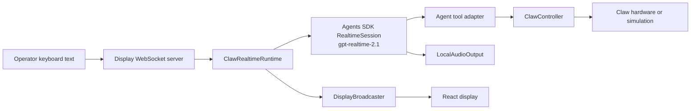
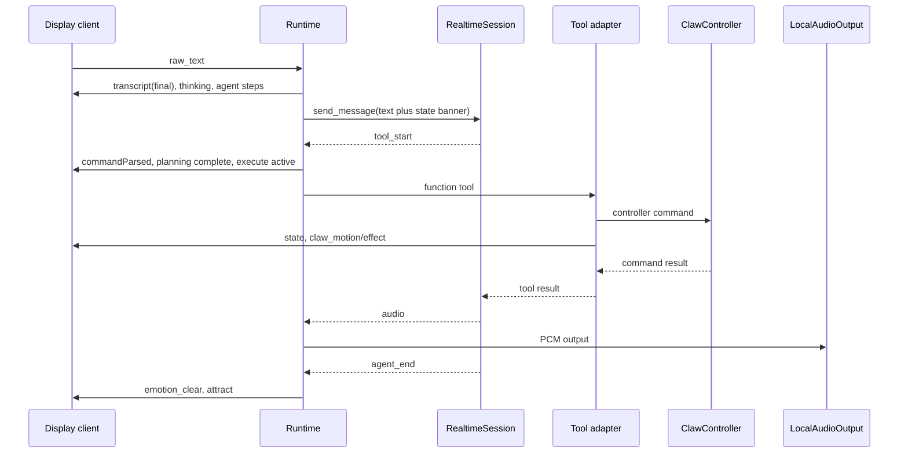
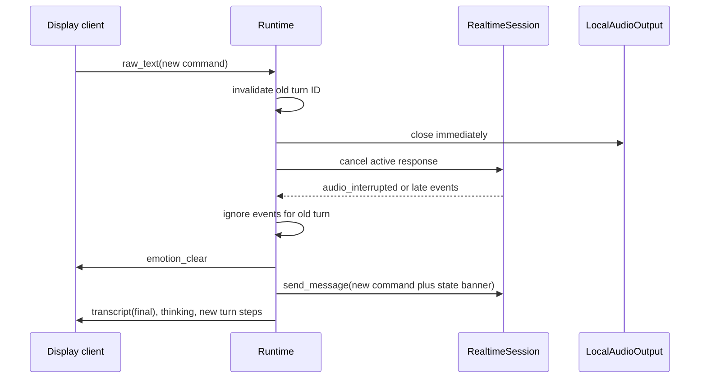

# Realtime Agents SDK Rewrite

## Context

The display backend is a Python WebSocket server. It accepts display-client messages, broadcasts display events, and delegates physical claw commands to `common.claw_controller`. The current realtime implementation is `packages/agent/realtime_service/service.py`; it uses Pipecat to manage an OpenAI Realtime session, audio input/output, tool calls, display events, and interruption. `packages/agent/server.py:run` starts that runtime and the display WebSocket server. `packages/web/src/hooks/useDisplaySocket.ts:useDisplaySocket` sends text and applies broadcast display events.

The replacement keeps the existing WebSocket display integration and local claw-controller integration, while replacing Pipecat with the OpenAI Agents SDK realtime runtime.

## Problem Statement

The current realtime service combines pipeline lifecycle, microphone capture, PCM buffering, VAD/barge-in logic, local playback, Realtime transport recovery, tool execution, turn management, and UI event emission in one implementation. That concentration makes it hard to reason about cancellation and leaves obsolete audio-input paths in a system whose supported operator input is text.

## Goals

- Replace Pipecat with the OpenAI Agents SDK realtime layer and `gpt-realtime-2.1`.
- Accept only text from the display-client WebSocket.
- Preserve persistent conversation history for the lifetime of the backend realtime session.
- Preserve local Realtime-model speech playback.
- Preserve all current tool attachments, controller calls, and display behavior.
- Automatically interrupt an active agent turn when a newer text command arrives.
- Keep physical-motion interruption deliberate: new text stops speech and model work; explicit stop language invokes the existing `halt` tool.
- Create a runtime whose public interface is small and independently testable.

## Non-goals

- Browser or host microphone capture.
- Browser WebRTC transport.
- Speech-to-text, PCM input buffering, VAD, ducking, or audio barge-in.
- A visual redesign of the display application.
- Changing the existing `common.claw_controller` serial protocol or simulation behavior.
- Adding an explicit stop UI control; a new text command is the interruption control.

## Assumptions

### Local speakers remain the output device

The backend continues to play generated PCM audio through `LocalAudioOutput`; it does not stream response audio to the browser. `packages/agent/common/audio_output.py:LocalAudioOutput` already owns the local output stream. Why: the operator input is becoming text-only, not silent-output.

### Realtime session history is service-scoped

One long-lived Agents SDK `RealtimeSession` retains context until the backend stops or the session is recreated after a transport failure. Why: the operator explicitly chose retained conversation history. The runtime continues to add current machine state to each user message, as `packages/agent/realtime_service/service.py:_build_user_turn_input` does today.

### Physical cancellation is not equivalent to coroutine cancellation

Cancelling an agent response cannot be treated as proof that an already-sent serial motion command has stopped. Why: controller calls delegate to the legacy serial implementation through `packages/agent/common/claw_controller/controller.py:ClawController`; the currently exposed direct controller commands do not take an interruption checker.

## Functional Requirements

### FR1: Text-only display input

The display WebSocket accepts a JSON text message:

```json
{ "type": "raw_text", "text": "move right 30 degrees" }
```

It may continue to accept `{ "type": "utterance", "text": "..." }` as a compatibility alias, but both types have identical text semantics. Empty and malformed messages are ignored or rejected without creating a turn. Binary frames are ignored or rejected and never forwarded to the realtime session.

`packages/web/src/hooks/useDisplaySocket.ts:useDisplaySocket` already sends the `raw_text` form.

### FR2: Realtime agent

The runtime creates an Agents SDK `RealtimeAgent`, `RealtimeRunner`, and persistent `RealtimeSession`. The runner uses model `gpt-realtime-2.1`, server-side WebSocket transport, audio output in PCM16, automatic tool choice, and no audio input configuration. `RealtimeSession.send_message()` is used for text turns. The SDK supports this server-side session lifecycle, text messages, audio output events, function tools, and interruption events. Source: [OpenAI Agents SDK Realtime guide](https://openai.github.io/openai-agents-python/realtime/guide/) and [quickstart](https://openai.github.io/openai-agents-python/realtime/quickstart/).

### FR3: Tool parity

The attached tool inventory, public names, schemas, and observable side effects are preserved from `packages/agent/realtime_service/service.py:_build_tools_schema` and its matching `_tool_*` methods:

| Tool | Input | Required behavior |
|---|---|---|
| `move_axis` | `axis`: `x`, `y`, or `z`; `degrees`: number | Call `ClawController.move_axis`; emit signed-direction motion UI events. |
| `open_claw` | none | Open at the existing fixed angle of 90. |
| `lower_claw` | optional nonnegative `degrees` | Use existing configured default when omitted; emit dropping and `dropStarted`. |
| `raise_claw` | none | Retract; emit upward motion. |
| `close_claw` | none | Close at the existing fixed angle of 25. |
| `home_z` | none | Home Z; emit moving state. |
| `home` | none | Run full homing; emit moving state. |
| `get_state` | none | Return existing controller state payload. |
| `halt` | none | Invoke controller emergency stop. |
| `reset_emergency` | none | Clear controller emergency latch. |
| `set_expression` | required enumerated `mood`; optional `emotion` | Emit normalized frontend emotion only; never access hardware. |

The ClawPilot prompt retains its current personality, degree/sign conventions, `STUCK` and `LIMIT` instructions, Z-homing rule, and urgent-stop guidance from `packages/agent/realtime_service/service.py:SYSTEM_PROMPT_TEMPLATE`.

### FR4: Physical tool serialization

Exactly one hardware-affecting tool executes at a time. A single internal controller-execution lock protects every physical tool. `set_expression` bypasses that lock; `get_state` does not mutate hardware. Each hardware tool awaits its real controller result rather than acknowledging completion early. This replaces the existing background acceptance path in `packages/agent/realtime_service/service.py:_run_serialized_tool_call`.

### FR5: Automatic turn interruption

When new nonempty text arrives while a turn is active, the runtime must:

1. invalidate the active turn before beginning the replacement turn;
2. stop local speaker playback immediately;
3. request cancellation of the active Realtime response;
4. suppress stale response, tool, and terminal UI events from the invalidated turn;
5. retain session conversation history; and
6. submit the new text as the next active turn.

A user request containing urgent stop language remains governed by the existing agent instruction to call `halt` first. New text by itself does not implicitly emergency-stop already-issued physical motion. It stops speech, cancels model work, and prevents unstarted physical tools.

The Agents SDK emits `audio_interrupted` and aligns session history when an active response is interrupted; local playback still stops as soon as the application starts cancellation rather than waiting for the asynchronous event. Source: [OpenAI Agents SDK interruption behavior](https://openai.github.io/openai-agents-python/realtime/guide/#interruptions-and-playback-tracking).

### FR6: Display-event compatibility

The replacement emits the existing event union in `packages/web/src/types/display.ts:DisplayEvent`: `state`, `emotion`, `emotion_clear`, `transcript`, `agent_step`, `claw_motion`, `target`, `result`, and `effect`. `packages/web/src/state/displayStore.ts:applyEvent` remains the display consumer.

For text input, emit the final `transcript` event with the submitted text. Retain the `speech_to_text` agent step for visual parity, but define it as “input accepted” rather than literal speech transcription.

### FR7: Error and shutdown behavior

On an unrecoverable session or tool error, emit the current error state/effect sequence, clear expression override, and return to `attract`. On a recoverable session disconnect, recreate the session without recreating the controller and make a later text input usable. Shutdown closes the active SDK session, cancels active local tasks, closes local audio output, and stops the controller.

## Non-functional Requirements

- **Cancellation latency:** local speaker output must be closed before awaiting network cancellation or tool cleanup.
- **Event correctness:** an event associated with an invalidated turn must never overwrite state for the current turn.
- **Hardware correctness:** no two controller command tools run concurrently; an already-dispatched command is never claimed to have stopped merely because an asyncio task was cancelled.
- **Runtime simplicity:** `server.py` depends on one runtime interface and contains no model, audio, or tool orchestration.
- **Compatibility:** the normal display event schema remains source-compatible with the existing web display.
- **Observability:** structured logs include `turn_id`, current state, SDK event type, tool name/call ID, interruption reason, and session reconnect reason. Do not log user messages or credentials by default.

## Logical View



`server.py` owns client connections and parses only display input. `ClawRealtimeRuntime` is the sole owner of the SDK session, turn state, event loop, local player, and tool adapter. `ClawController` remains the hardware seam.

## Module Interfaces

### Runtime

```python
class ClawRuntime(Protocol):
    async def start(self) -> None: ...
    async def stop(self) -> None: ...
    async def submit_text(self, text: str, *, source: str) -> None: ...
    async def interrupt(self, *, reason: str) -> None: ...
```

`server.py` crosses only this interface. The runtime owns all SDK-specific behavior.

### Turn coordinator

The coordinator owns one active `Turn` with:

- monotonic `turn_id`;
- cancellation state and reason;
- active SDK response identity when available;
- an optional task for the submitted turn;
- physical-tool-in-flight status; and
- terminal-event eligibility.

All asynchronous handlers must check the turn identity before emitting a terminal or non-idempotent display event.

### Tool adapter

The tool adapter receives the controller, broadcaster, and a turn-eligibility predicate. It contains all schema definitions and controller/UI side effects. It is the only code that constructs Agents SDK function tools.

### Event bridge

The event bridge is the only consumer of SDK session events. It translates `agent_start`, `agent_end`, `tool_start`, `tool_end`, `audio`, `audio_end`, `audio_interrupted`, and `error` into runtime state transitions, local audio actions, and display events.

## Process View

### Ordinary text turn



### Replacement text interrupts an active response



If a hardware command has already been sent, its result is awaited for controller safety but its stale UI completion may not overwrite the new turn. Explicit stop language is handled by the agent using `halt`.

## Implementation Plan

1. Add a tested `openai-agents` dependency and remove Pipecat after the replacement is passing.
2. Extract the prompt, emotion mapping, and exact tool schema/side-effect logic from `service.py` into a tool adapter module.
3. Implement `ClawRealtimeRuntime` around `RealtimeAgent`, `RealtimeRunner`, and a persistent `RealtimeSession` using `gpt-realtime-2.1`.
4. Implement the turn coordinator and stale-event filtering before wiring the WebSocket server.
5. Wire SDK events to the current display event contract and `LocalAudioOutput`.
6. Simplify `server.py` to strict text parsing and `submit_text` dispatch; remove microphone CLI and binary handling.
7. Remove dead web microphone code and socket audio-send API.
8. Remove Pipecat and microphone-input configuration/dependencies after import and integration checks pass.
9. Update README, environment documentation, and launch recipes.

## Test Plan

### Unit tests

- All eleven tools expose their existing names, schemas, controller calls, result payloads, and display side effects.
- Hardware tools serialize; expression changes do not take the hardware lock.
- Text input emits final transcript and the visual agent-step sequence.
- A newer turn invalidates the old turn; old `agent_end`, audio, tool-end, and error events do not alter the new turn UI.
- Interrupt closes the player synchronously before awaiting session cancellation.
- Urgent-stop intent can invoke `halt`; ordinary replacement text does not implicitly invoke it.
- Controller errors produce expected error state/effect and recover to `attract`.

### Integration tests with a fake RealtimeSession

- One normal command creates the expected session message, calls a tool, plays audio, and returns to `attract`.
- A replacement command during audio stops playback and produces only the second turn terminal display state.
- A replacement command before tool dispatch prevents the old tool from executing.
- A replacement command during a controller call does not dispatch another physical command concurrently.
- Session disconnect/recreation permits later text input and preserves a consistent display state.
- Binary display-client frames are rejected/ignored and never call the runtime.

### Manual hardware validation

- Verify each physical tool in simulation, then serial mode.
- Confirm the speaker stops when a second keyboard command is submitted mid-response.
- Confirm an explicit “stop” request invokes the hardware halt path.
- Confirm stale spoken or tool completion events do not overwrite the new command's display state.

## Open Questions

None blocking. The following are implementation details to validate against the installed SDK release:

- The exact SDK cancellation method and response identity exposed by the chosen `openai-agents` version.
- Whether SDK `tool_start`/`tool_end` contain a stable turn/response identifier sufficient for direct stale-event attribution; if not, the coordinator must serialize dispatch and attach local generation tokens at the event bridge.
- Whether the existing `LocalAudioOutput.close()` behavior is sufficient to flush device-buffered PCM on the target macOS audio device; benchmark interruption latency before declaring the requirement met.
